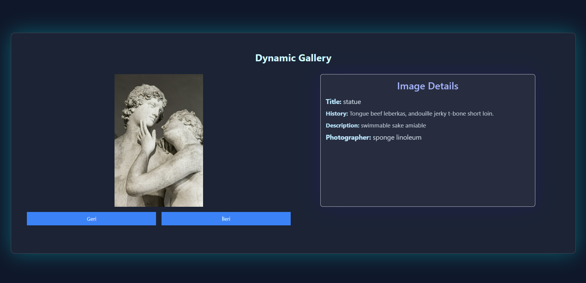
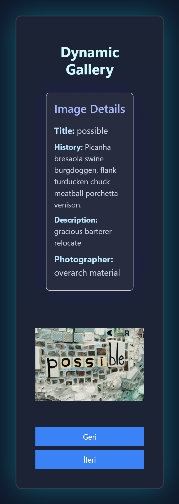
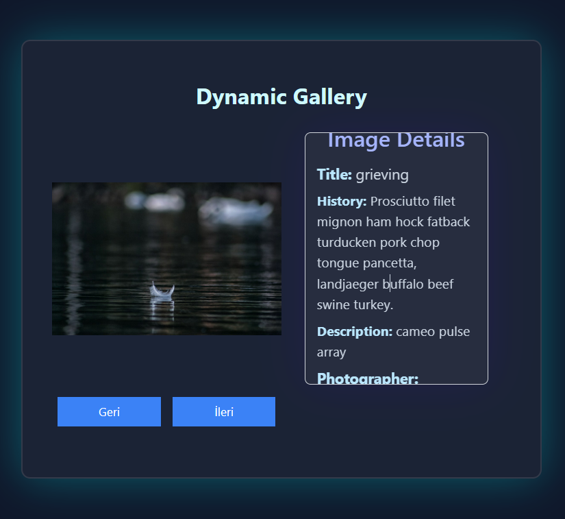
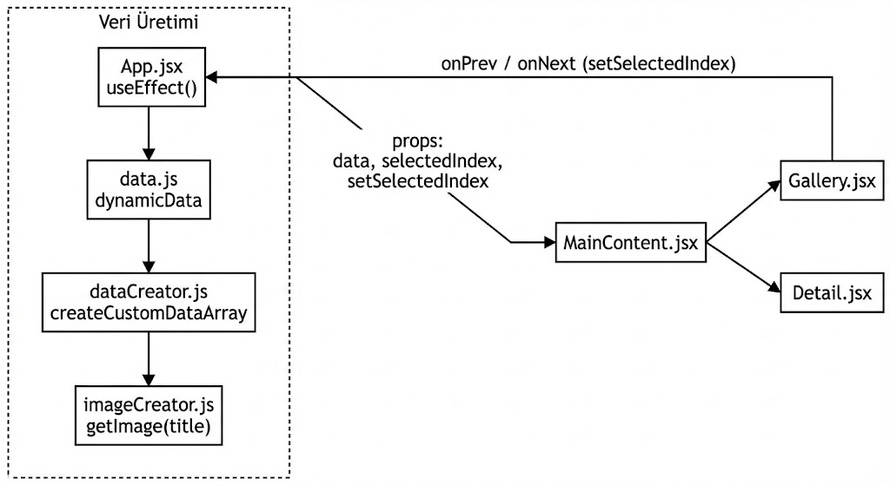

# React-State (English Version)

> A compact playground to practice dynamic data generation, image fetching (Unsplash), Tailwind CSS styling, and React component state/props flow – all in one place.

<p align="center">
  
  
  
</p>

---
## Goal
- Understand relationship between React `state` and `props`
- Generate dynamic content from external APIs (random words + bacon ipsum + image)
- Use Unsplash API key securely via environment variables
- Apply Tailwind CSS for fast responsive styling
- Navigate a simple gallery (next / previous) and re-render selected item

## Architecture Flow (Summary)

<p align="center">
  
</p>

- App fetches & assembles data on initial mount (word + sentence + image).
- The produced array plus `selectedIndex` are passed down to `MainContent`.
- `Gallery` updates the index; `Detail` renders selected item meta.
- If an image can't be fetched, `imageCreator` falls back to a static URL.

---
## Key Files
| Path | Purpose |
|------|---------|
| `src/App.jsx` | Root component: fetches data & holds selection state |
| `src/components/mainContent.jsx` | Chooses current item and composes gallery + details |
| `src/components/gallery.jsx` | Shows image and navigation buttons |
| `src/components/detail.jsx` | Displays textual details of selected item |
| `src/database/data.js` | Exposes `dynamicData` entry point |
| `creator/dataCreator.Js` | Orchestrates generation (word / sentence / image) |
| `creator/imageCreator.js` | Queries Unsplash or uses fallback + caching |
| `tailwind.config.js` | Tailwind content paths configuration |

---
## Environment Variable
Unsplash requires an access key:
```
VITE_SPLASH_ACCESS_KEY=YOUR_UNSPLASH_ACCESS_KEY
```
Defined in `.env` and read via `import.meta.env.VITE_SPLASH_ACCESS_KEY` inside `imageCreator.js`.


---
## Setup & Run
```bash
npm install       # install dependencies
npm run dev       # start Vite dev server
```
Access usually at: `http://localhost:5173`

---
## Data Generation Logic
`createCustomDataArray` simplified shape:
```js
createCustomDataArray({
  itemCount: 5,
  wordCount: 1,
  sentenceCount: 1,
  shortSentence: 1,
  imageCount: 1
}) => [ { title, word1, Sentence1, ShortSentence1, image1 }, ... ]
```
- Random words: `random-word-api`
- Sentences: `baconipsum`
- Image: Unsplash search (by title word)
- Fallback: static URL if rate limited or no result

---
## UI Flow
1. App mounts → fetch data (5 items).
2. State: `data[]` + `selectedIndex`.
3. Gallery buttons update `selectedIndex`.
4. React re-renders → new detail + image visible.

---
## Learning Highlights
| Topic | Example |
|-------|---------|
| State init | `const [selectedIndex, setSelectedIndex] = useState(0);` |
| Prop passing | `<MainContent data={data} selectedIndex={selectedIndex} onChangeIndex={setSelectedIndex} />` |
| Derived state | `const current = data[selectedIndex];` |
| Fallback handling | Static URL when image not found |

---
## Error / Rate Limit Handling
- Unsplash 403 → `console.warn` + cache + fallback URL
- Same search word → cached result, no duplicate API call
- StrictMode double invoke in dev → can be guarded via `useRef`

---
## Tailwind Usage
Utility classes like: `flex`, `gap`, `text-slate-300`, `backdrop-blur-sm`, etc.  
Responsive layout: `flex-col-reverse sm:flex-row` (mobile stacked, desktop side-by-side).

---
## FAQ
| Question | Answer |
|----------|--------|
| Why are some images identical? | Rate limit or no result triggers fallback. |
| Why did data fetch twice? | Dev StrictMode intentionally double-invokes effects. |
| Why `.env`? | To keep the Unsplash API key private. |

---
## License
Educational purpose. Images follow Unsplash licensing. Adapt freely.

---
## Summary
Shows React state flow, prop chaining, async data assembly, image fallback strategy, and Tailwind styling in one concise project. Experiment with the code to internalize the re-render cycle.
