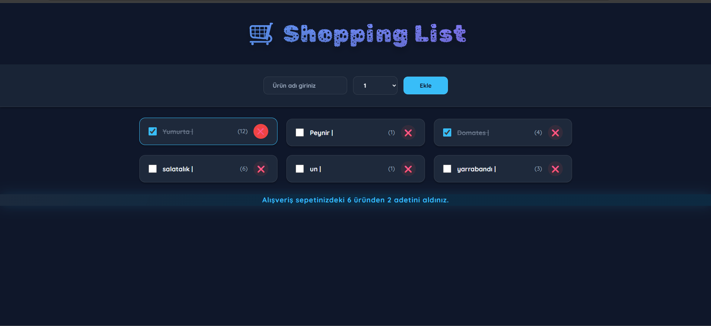
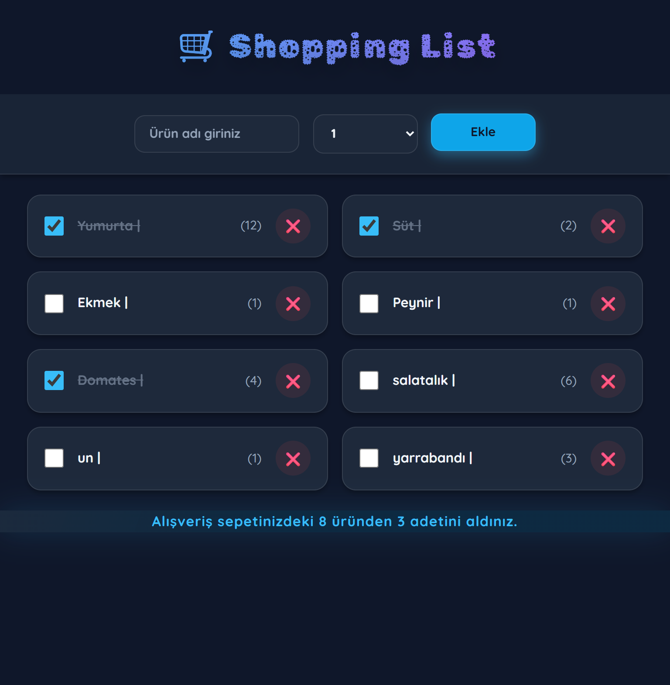
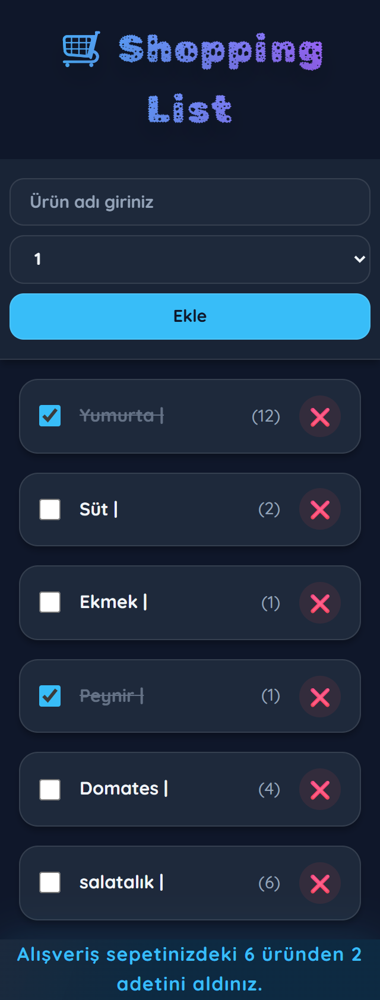

# Shopping List

> A simple React project with a straightforward interface, created to understand state management and data flow between components.

<p align="center">
  
  
  
</p>

---
## Objective
- To understand data communication between components using React `state` and `props`.
- To see how state is updated through user interactions (adding, deleting, completing).
- To manage forms and create new data based on user input.
- To dynamically render lists and effectively use the `map` function.
- To reinforce the fundamental building blocks of React (component, state, props) through a simple project.

---
## Important Files
| Path | Description |
|---|---|
| `src/App.jsx` | The main component. It holds all the states (total items, completed items) and passes data and functions to other components via `props`. |
| `src/header.jsx` | A simple component that displays the page title. |
| `src/form.jsx` | The form used to add new shopping items. It takes user input and sends the new item data to the `App` component. |
| `src/mainList.jsx` | The component that renders the shopping list and each item (`Item`) in the list. It contains the logic for deleting and completing items. |
| `src/summary.jsx` | The summary component at the bottom of the list, showing the total and completed item counts. |

---
## Application Flow

1.  **Initial Load**: The default list defined in `mainList.jsx` is displayed on the screen. `App.jsx` calculates the number of completed and total items in this list and sends it to the `Summary` component.
2.  **Adding an Item**: The user enters a product name and quantity via `form.jsx` and clicks the "Add" button.
    -   The form sends the new item object to `App.jsx`.
    -   `App.jsx` updates its state and adds this new item to `mainList.jsx`.
    -   The total item count increases, and the `Summary` is updated.
3.  **Completing an Item**: The user clicks on an item or the checkbox next to it.
    -   The `Item` component within `mainList.jsx` changes the item's `completed` status to `true` or `false`.
    -   The number of completed items is recalculated and passed to the `Summary` component via `App.jsx`.
4.  **Deleting an Item**: The user clicks the "❌" button next to an item.
    -   The `Item` component filters the item out of the `items` array.
    -   The total and completed item counts are recalculated, and the `Summary` is updated.

---
## Learning Points
| Topic | Example |
|---|---|
| State Definition and Update | `const [totalItems, setTotalItems] = useState(6);` |
| Passing Data with Props | `<Summary completedItem={completedItem} totalItems={totalItems} />` |
| Passing Functions with Props | `<Form ItemSend={AddNewItem} />` |
| Rendering Lists | `items.map((item) => (<Item item={item} key={item.id} />))` |
| Conditional Styling | `<li className={item.completed ? 'completed' : ''}>` |
| Controlled Forms | `const [name, setName] = useState('');` <br> `<input type="text" value={name} onChange={(e)=> setName(e.target.value)} />` |

---
## Setup & Run
```bash
# Install dependencies
npm install

# Run the development server
npm run dev
```
When Vite is running, it's typically available at: `http://localhost:5173`

---
## License
This work is for learning purposes. You can adapt and use it in your own projects as you wish.
